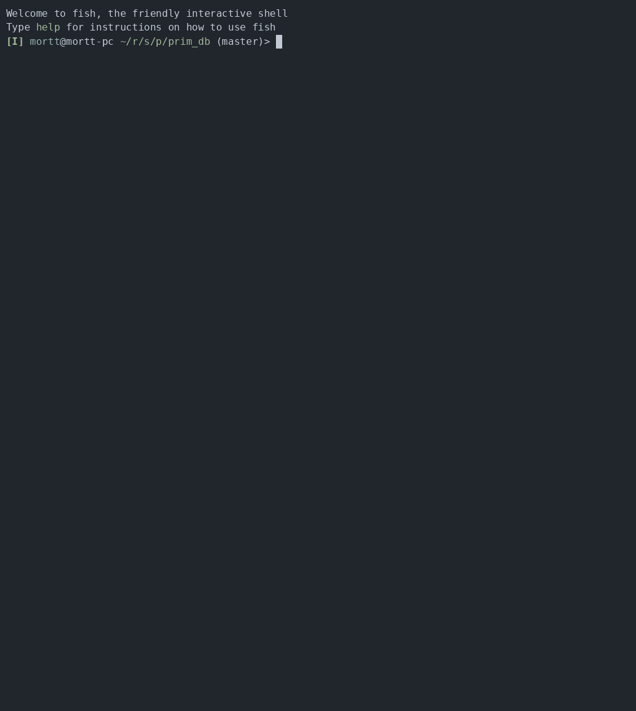
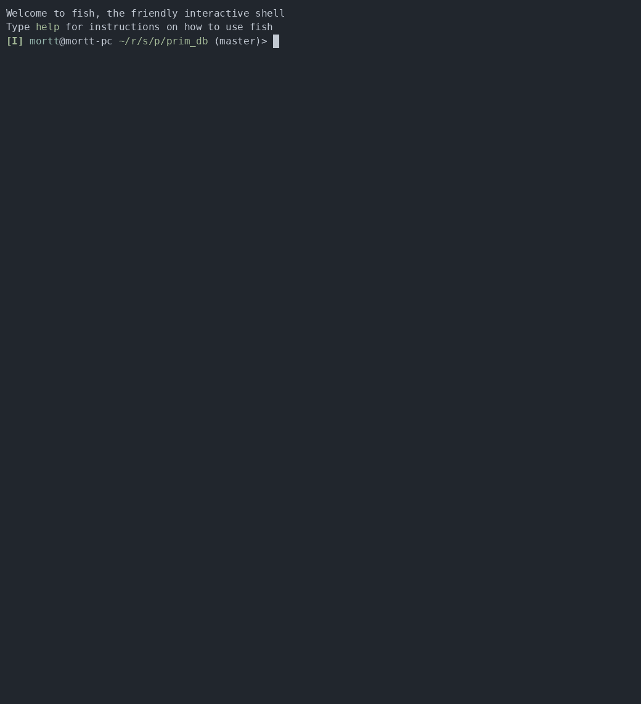

# prim-db

Примитивная база данных с консольным интерфейсом. Позволяет управлять таблицами и выполнять CRUD-операции над их
записями; метаданные и данные таблиц хранятся в JSON-файлах.

## Требования

- Python 3.12+
- [uv](https://docs.astral.sh/uv/)

## Установка и запуск

Запуск из каталога проекта:

```sh
uv sync
uv run prim-db
```

Установка в систему как инструмента:

```sh
uv tool install .
prim-db
```

Сборка пакета:

```sh
uv build
```

## Управление таблицами

| Команда | Описание |
| --- | --- |
| `create_table <имя_таблицы> <столбец1:тип> <столбец2:тип> ...` | Создать таблицу |
| `list_tables` | Показать список всех таблиц |
| `drop_table <имя_таблицы>` | Удалить таблицу |
| `help` | Показать справку |
| `exit` | Выйти из программы |

Поддерживаемые типы столбцов: `int`, `str`, `bool`. Если столбец `ID` не задан, он добавляется автоматически первым
столбцом с типом `int`.

Пример использования:

```text
>>> Введите команду: create_table users name:str age:int is_active:bool
Таблица users создана успешно
>>> Введите команду: create_table users name:str
Произошла ошибка во время выполнения команды: Таблица с именем users уже существует
>>> Введите команду: list_tables
users
>>> Введите команду: drop_table products
Произошла ошибка во время выполнения команды: Таблица с именем products не найдена
```

## CRUD-операции

| Команда | Описание |
| --- | --- |
| `insert into <имя_таблицы> values (<значение1>, <значение2>, ...)` | Создать запись |
| `select from <имя_таблицы>` | Прочитать все записи |
| `select from <имя_таблицы> where <столбец> = <значение>` | Прочитать записи по условию |
| `update <имя_таблицы> set <столбец> = <значение> where <столбец> = <значение>` | Обновить записи |
| `delete from <имя_таблицы> where <столбец> = <значение>` | Удалить записи |
| `info <имя_таблицы>` | Вывести информацию о таблице |

Значение `ID` при вставке не передается: оно генерируется автоматически (целое число начиная с 1). Все остальные поля обязательны. Строковые
значения указываются в кавычках.

Пример использования:

```text
>>> Введите команду: insert into users values ("Sergei", 28, true)
Строка успешно добавлена в таблицу users
>>> Введите команду: select from users where age = 28
+----+--------+-----+-----------+
| ID |  name  | age | is_active |
+----+--------+-----+-----------+
| 1  | Sergei |  28 |    True   |
+----+--------+-----+-----------+
>>> Введите команду: update users set age = 29 where name = "Sergei"
Изменено 1 записей
>>> Введите команду: delete from users where ID = 1
Удалено 1 записей
>>> Введите команду: info users
Таблица: users
Столбцы: ID:int, name:str, age:int, is_active:bool
Количество записей: 0
```

## Обработка ошибок и вспомогательные возможности

- Ошибки выполнения команд (некорректные значения, отсутствующие таблицы и столбцы, отсутствующие файлы данных)
  перехватываются при выполнении команды; выводится сообщение об ошибке, данные не изменяются.
- Удаление таблицы и удаление записей требуют подтверждения. Любой ответ, кроме `y`, отменяет операцию.
- Для `insert` и `select` выводится время выполнения.
- Результаты `select` кэшируются; кэш сбрасывается при любом изменении данных или метаданных.

Пример использования:

```text
>>> Введите команду: drop_table users
Вы уверены, что хотите выполнить "удаление таблицы"? [y/n]: n
Пользователь отменил команду
>>> Введите команду: insert into users values ("Sergei", "28", true)
Ошибка валидации: Некорректное значение: "28"
>>> Введите команду: select from users
Функция "select" выполнилась за 0.000 секунд
+----+--------+-----+-----------+
| ID |  name  | age | is_active |
+----+--------+-----+-----------+
| 1  | Sergei |  28 |    True   |
+----+--------+-----+-----------+
```

## Хранение данных

Метаданные хранятся в файле `data/db_meta.json`, данные каждой таблицы - в отдельном файле `data/<имя_таблицы>.json`.
Каталог `data/` и пустой файл метаданных создаются в текущем рабочем каталоге при первом запуске. При удалении таблицы
удаляется и файл ее данных.

```json
{
  "tables": [
    {
      "name": "users",
      "columns": [
        {"name": "ID", "type": "int"},
        {"name": "name", "type": "str"}
      ]
    }
  ]
}
```

## Структура проекта

| Модуль | Назначение |
| --- | --- |
| `src/prim_db/main.py` | Точка входа |
| `src/prim_db/engine.py` | Цикл обработки команд |
| `src/prim_db/parser.py` | Разбор ввода и классы команд |
| `src/prim_db/core.py` | Операции над таблицами и записями |
| `src/prim_db/model.py` | Классы метаданных: база данных, таблица, столбцы, столбец |
| `src/prim_db/decorators.py` | Декораторы обработки ошибок, подтверждения и замера времени; кэширование |
| `src/prim_db/exceptions.py` | Исключения приложения |
| `src/prim_db/utils.py` | Загрузка и сохранение метаданных и данных таблиц |
| `src/prim_db/constants.py` | Константы: пути к файлам, типы данных и прочие значения |


## Демонстрация

### Управление таблицами


### CRUD-операции



### Обработка ошибок и подтверждение действий


